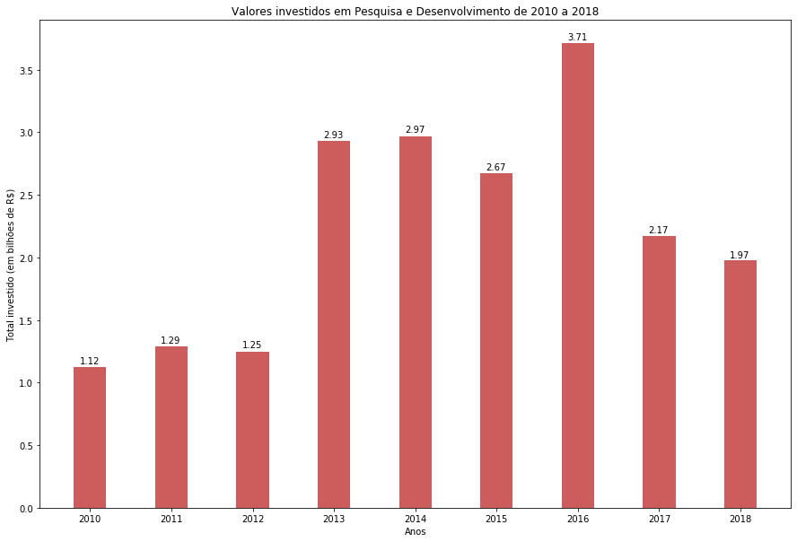

# Investimentos Federais em Pesquisa e Desenvolvimento nas Instituições de Ensino Superior (2010 - 2018)
As discussões sobre os investimentos em Pesquisa e Desenvolvimento nunca estiveram tão acirradas. 
As calorosas manifestações contra as ameaças de corte de recursos nas instituições de ensino superior 
brasileiras demonstram que o país está na contramão dos países desenvolvidos e daqueles que buscam 
sair do subdesenvolvimento, os quais, por sua vez, investem em políticas com o objetivo de incentivar 
e acelerar o desenvolvimento desse setor.

Esta análise de microdados permite observar essa retração tão divulgada nas mídias de comunicação. 
Para tal, microdados do Censo Anual da Educação Superior, disponíveis no site do INEP (http://inep.gov.br/microdados), 
foram utilizados. O período analisado inicia em 2010, quando os valores de investimentos em Pesquisa 
e Desenvolvimento passaram a ser contabilizados, e finda em 2018, ano do último censo.

